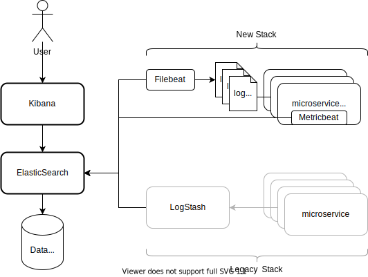

# ElasticSearch - Kibana Stack



## Run in docker-compose
```
docker-compose -f ek-docker-compose.yml up -d
docker-compose -f ek-docker-compose.yml down -v --rmi all --remove-orphans
```

## Run in Docker Swarm mode
```
docker stack deploy -c ek-docker-swarm.yml ek-stack
docker stack rm ek-stack

docker stack ps ek-stack
docker stack services ek-stack
docker volume inspect ek-stack_elastic_data 
```

## Run in plain Docker

#### ElasticSearch

```
mkdir /opt/data/elasticsearch-data
chown -R user:group /opt/data/elasticsearch-data
docker run -d --name elasticsearch \
  --restart unless-stopped \
  -p 9200:9200 -p 9300:9300 \
  -e "discovery.type=single-node" \
  -v "/opt/data/elasticsearch-data:/usr/share/elasticsearch/data" \
  --network host \
  elasticsearch:7.15.2
docker logs -f elasticsearch
docker stop elasticsearch
docker rm elasticsearch
```
```
curl http://localhost:9200/_cluster/health
curl http://localhost:9200/_cat/master
curl http://localhost:9200/_cat/indices
```

#### Kibana
```
docker run -d --name kibana \
  --restart unless-stopped \
  -p 5601:5601 \
  -e "ELASTICSEARCH_HOSTS=http://localhost:9200" \
  --network host \
  docker.elastic.co/kibana/kibana:7.15.2
docker logs -f kibana
docker exec -it kibana /bin/bash
docker stop kibana
docker rm kibana
```
```
http://localhost:5601/
```

#### Log Stash (optional)
Logstash  is no longer required when using [Elastic Beats](https://www.elastic.co/beats/) components.
```
docker run -d --name logstash \
  --restart unless-stopped \
  -p 5044:5044 \
  -e "monitoring.elasticsearch.hosts=http://localhost:9200" \
  -e "xpack.monitoring.enabled=false" \
  -v "/opt/data/logstash-data/logstash.conf:/usr/share/logstash/config/logstash.conf" \
  --network host \
  docker.elastic.co/logstash/logstash:7.15.2
```

## References
* [ELK on docker](https://www.elastic.co/guide/en/elastic-stack-get-started/master/get-started-docker.html) 
* [OpenSearch](https://opensearch.org/)
